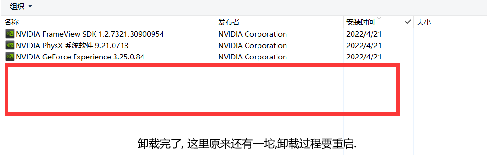
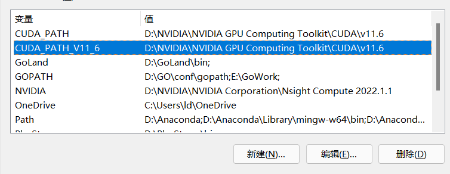
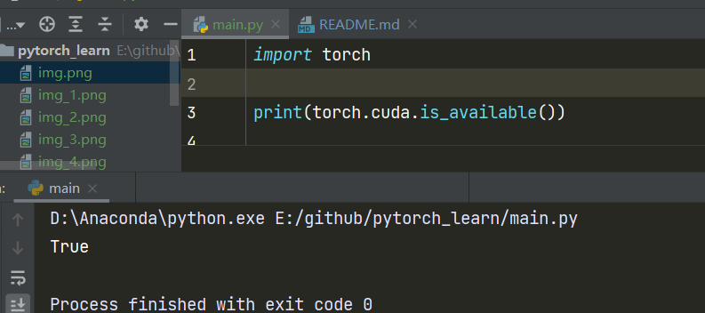

# pytorch

## 安装
- 最简单也最复杂
- 百度出来第一个csdn的安装教程,看着很详细实则很坑爹
    - 不要看什么GPU算例, 选择cuda版本
    - 直接看控制面板的cuda驱动版本, 如: cuda11.2
    - 有个教程里选择版本号9.0, 放的链接是9.1太坑了
    - 大多数情况下 *驱动* 已经不需要装了,直接装cuda即可,cudnn选择性安装吧
- 推荐cuda安装教程: https://zhuanlan.zhihu.com/p/131595687
### 1.大胆
- 不要怕装坏了.驱动程序装不成功就卸载,重启电脑你会发现驱动又回来了.win11会自己安装驱动
### 2.尝试
- cuda和cudnn两个包太大了,也不知道哪里出了问题, 我装完之后C盘小了10G
- 这个东西是默认装C盘的(好像9.0版本的cuda是可以选择的)
- 修改默认安装路径:
    - 先正常安装
    - 到默认安装路径下: C:\Program Files\ 下复制 NVIDIA Corporation和NVIDIA GPU Computing Toolkit两个文件夹到 D:NVIDIA(你想要安装的其他路径)
    - 
    - 卸载掉刚安装的cuda(去控制面板-程序里卸载刚才安装以nvidia开头的这些基本就是了,最简单看安装时间)
    - 
    - 最后*关键*添加环境变量 D:\NVIDIA\NVIDIA GPU Computing Toolkit\CUDA\v11.6\bin 到 path
    - ps: 我还添加了两个环境变量 CUDA_PATH和CUDA_PATH_V11_6 都是: D:\NVIDIA\NVIDIA GPU Computing Toolkit\CUDA\v11.6 (不知道不设置会不会有问题)
    -  
    - 
- 可以正常启动,完美撒花
    - 

## 视频地址
- https://www.bilibili.com/video/BV1J44y1i734?p=1

